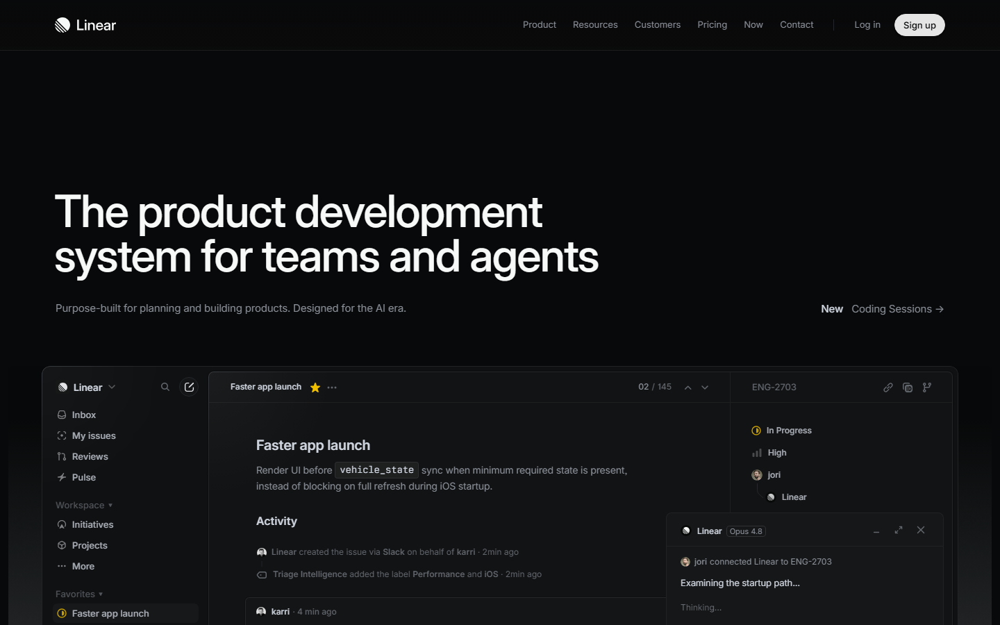
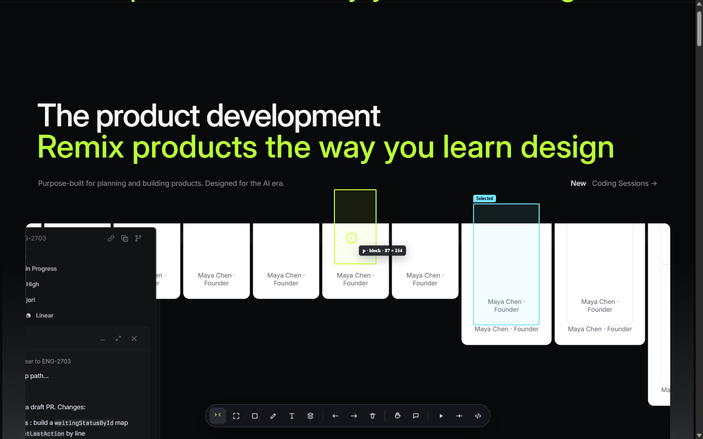
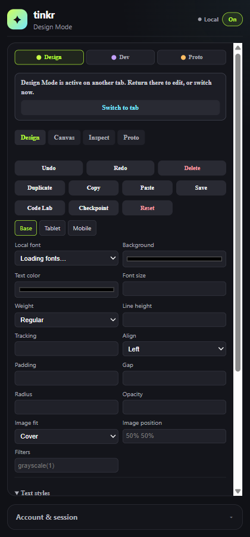
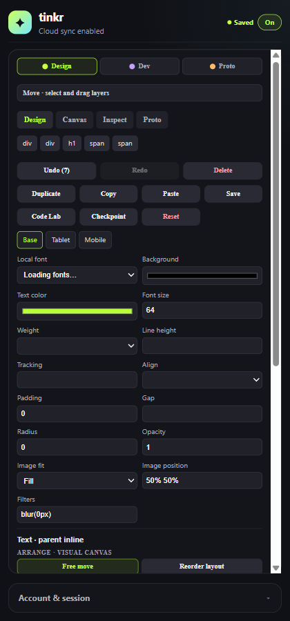
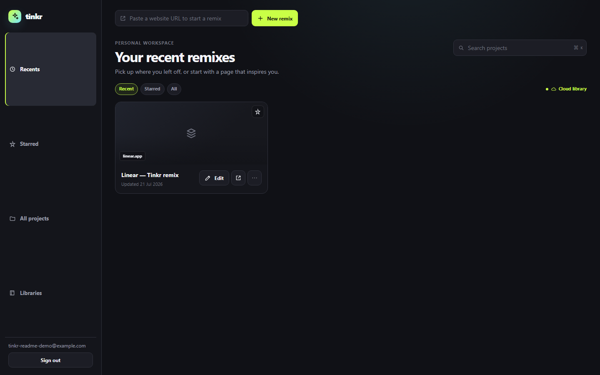
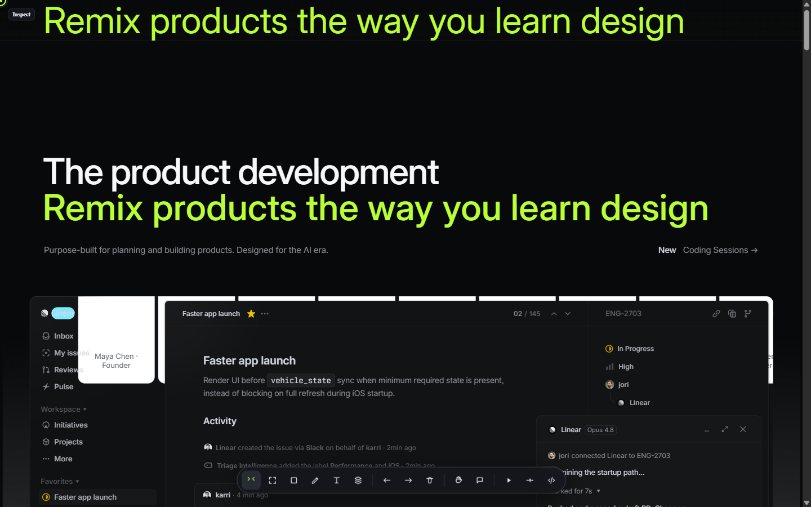

# tinkr

> Learn design by changing what you can already see.

I started tinkr because learning design often creates a frustrating gap: I would find a landing page, product screen, or interaction I loved, then have to open a blank Figma file and try to rebuild it before I could experiment. I did not want to copy a whole website or publish someone else's work. I just wanted to move a headline, try a different CTA, borrow the rhythm of a card, layer something over a hero, and learn by playing.

tinkr turns that impulse into a workspace. It is a Chrome extension that turns the webpage currently open in your browser into a private, remixable design canvas. Select what you see, move it, restyle it, add your own components, layer ideas on top, and save the remix to continue later.

The original website is never published from tinkr and its backend is never changed.

## What it is

tinkr is a live-web design layer for founders, builders, and people learning design.

- Open a public webpage and enter **Design Mode**.
- Select visible text, images, buttons, cards, or sections.
- Move and layer elements freely on the visual canvas, or use structural mode to reorder compatible source-layout siblings.
- Edit copy, type, color, spacing, radius, image treatment, and layout properties.
- Add tinkr-owned CTAs, feature cards, testimonials, wireframes, vectors, comments, and assets.
- Record changes as reversible patches, then sync projects, reviews, collaboration, and history to tinkr Cloud when signed in.

tinkr is intentionally not a website copier, publisher, or production-code editor. It is a place to explore an idea quickly and keep the work you make.

## How the canvas works

tinkr uses the HTML, CSS, assets, and layout already loaded in the current tab. It records reversible patches instead of changing the source site.

When possible, a change is applied directly to the selected DOM element: text updates, CSS overrides, `translate`, `z-index`, and compatible reorder operations. When an element is hard to manipulate safely because of clipping or stacking rules, tinkr can create a **visual copy**: a sanitized, tinkr-owned canvas layer that sits above the source element. This keeps experimentation expressive without cloning the whole page.

Every remix is private by default and can be reopened against the original URL. If a page changes and an old target no longer matches, tinkr should ask you to reattach the edit instead of applying it to the wrong element.

## Try it

1. Load the extension in Chrome, then open any `http` or `https` webpage.
2. Open the tinkr side panel, sign in, and choose **Enter Design Mode**.
3. Use the floating toolbar to select, move, pan, scale, add text, draw shapes, comment, prototype, or inspect.
4. Drag an element to move it freely. Drop it over another layer to place it above that layer.
5. Use the **Arrange** controls in the side panel to bring a layer forward/backward, place it on top of another layer, switch to structural reorder mode, or create a visual copy.
6. Changes autosave locally. Sign in when you want to sync a project to tinkr, reopen it from the dashboard, share a review, or collaborate.

Normal browser actions are blocked only while Design Mode is active, so you do not accidentally submit a form or navigate away while remixing.

See [Screenshots](#screenshots) for a full walkthrough on [linear.app](https://linear.app/).

## Screenshots

Demo remix of [linear.app](https://linear.app/) — the original site is never modified.

| Step | Preview |
| --- | --- |
| Original landing page |  |
| Design Mode remix with floating toolbar |  |
| Side panel editing controls |  |
| Cloud sync after sign-in |  |
| Project saved in tinkr dashboard |  |
| Reopened from cloud via dashboard |  |

## Studio capabilities

| Area | What you can do |
| --- | --- |
| Visual canvas | Free move, layer ordering, overlap, resize, hide, duplicate, visual copies, sections, notes, wireframes, vectors, and uploaded assets. |
| Live-DOM editing | Change text, typography, colors, spacing, radius, opacity, images, filters, responsive overrides, and compatible flex/grid layouts. |
| Components and variables | Save sanitized components, insert reusable variants, create color/spacing/radius/type variables, and apply tokens. |
| Dev Mode | Inspect computed styles, box model, accessibility details, patch diffs, CSS-like output, and patch JSON. |
| Prototyping | Add hotspots, safe CSS motion, comments, and review-ready annotations. |
| Cloud workspace | Private projects, autosave, checkpoints, visual review links, comments, presence, and a dashboard when signed in. |
| Code Labs | Run sandboxed JavaScript that emits reversible design operations; no cookies, network, page DOM, or credentials are exposed. |

## Boundaries

tinkr is built for exploration, not for changing another person's live product.

- It never publishes edits to the source website.
- Forms, payments, authenticated flows, browser-internal pages, cross-origin iframe internals, and canvas/WebGL interfaces are protected from direct interaction.
- tinkr can annotate or create a visual layer around unsupported content, but it does not claim to edit third-party rendered graphics as source vectors.
- Advanced code remains sandboxed and declarative; tinkr does not run arbitrary page JavaScript.

## Architecture

```text
Chrome extension (live Design Mode)
        |                  \
        | local drafts       \ cloud sync when signed in
        v                    v
Chrome storage          tinkr API -> Supabase
        |                         |
        +-------------------------+
                    |
          tinkr dashboard, editor, and review pages
```

- The extension is the authoritative live-page editor.
- The dashboard is where saved projects, revisions, visual reviews, and collaboration live.
- Cloud configuration belongs to tinkr operators, never extension users.

## Brand assets

The supplied tinkr mark is available as [PNG](assets/brand/tinkr-logo.png) and [JPEG](assets/brand/tinkr-logo.jpg). The extension also ships the required 16, 32, 48, and 128 px PNG icons from `assets/brand/`; the dashboard uses the matching PNG in `web/public/brand/`.

## Local development

Full instructions: **[docs/LOCAL.md](docs/LOCAL.md)**

### Quick start (Docker)

```bash
cp .env.docker.example .env.docker   # first time only
node scripts/dev-docker.mjs
```

Then load this repository as an unpacked extension from `chrome://extensions` (Developer mode). Local URLs are in [tinkr-config.js](tinkr-config.js).

### Extension-only (no backend)

You can load the extension UI without starting services, but a tinkr account and the local stack are required to enter Design Mode, save work, or use cloud features.

### Manual setup

```bash
node scripts/setup.mjs --manual
```

See [INSTALLATION.md](INSTALLATION.md) for a judge/tester path, or [docs/LOCAL.md](docs/LOCAL.md) for full contributor setup, Supabase, environment files, and troubleshooting.

## Hackathon submission

Read the complete judge narrative in [HACKATHON_SUBMISSION.md](HACKATHON_SUBMISSION.md). It covers the inspiration, product, architecture, challenges, lessons, and roadmap.

## Built with

- **Chrome Extension Manifest V3**, JavaScript, HTML, and CSS for the live-page Design Mode and side panel.
- **Next.js, React, and TypeScript** for the dashboard, project library, review pages, and authentication UI.
- **Node.js and Express** for the tinkr API and safe, structured AI-patch transport.
- **Supabase** for authentication, private project data, revisions, storage, and access control.
- **Docker and the Supabase CLI** for reproducible local development.
- An **OpenAI-compatible AI provider** for selection-scoped patch previews; tinkr never sends a whole webpage or executes arbitrary generated scripts.

### Built with Codex and GPT-5.6 Terra

tinkr was built with Codex as an active product and engineering collaborator, powered by **GPT-5.6 Terra**. We used Planning Mode to turn a broad idea—"make any webpage a design canvas"—into bounded, testable work across the extension, dashboard, persistence, and safety model.

- **Medium reasoning** was used for focused UI work, component implementation, documentation, and iterative fixes.
- **High reasoning** was used for extension architecture, DOM patching, Figma-inspired interaction design, and reliability reviews.
- **Ultra reasoning** was reserved for higher-risk problems such as idempotent replay, source-anchor safety, session handoff, cloud-sync conflicts, and the distinction between native DOM edits and visual proxies.
- The **Supabase plugin** informed authentication, storage, RLS, migration, and session-security decisions.
- The **GitHub plugin** supported repository orientation, commit/review workflows, and keeping the implementation traceable as the project evolved.

GPT-5.6 Terra was used in the development process; the runtime AI feature remains provider-configurable and is intentionally constrained to safe, inspectable patch operations.

## Project links and judge testing

- Source: [github.com/hatif03/tinkr](https://github.com/hatif03/tinkr)
- Full installation and testing guide: [INSTALLATION.md](INSTALLATION.md)
- Hosted dashboard beta, when the deployment is enabled: [tinkr-web-henna.vercel.app](https://tinkr-web-henna.vercel.app)

## Project status

tinkr is an experimental creative tool. Its core promise is simple: when a design on the web sparks an idea, you should be able to start playing immediately instead of rebuilding it from scratch.
